# NS_02 - Image Scanner: Walkthrough per la Risoluzione

Questo documento descrive i passaggi seguiti per risolvere la challenge CTF "NS_02 - Image Scanner", dove la flag era nascosta nei layer di un'immagine Docker.

# Comando utilizzato per avviare il container e ottenere una shell interattiva
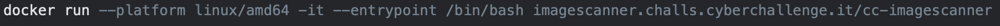

Una volta dentro il container, ispezionare il filesystem.

1. Ispezione Iniziale all'Interno del Container:
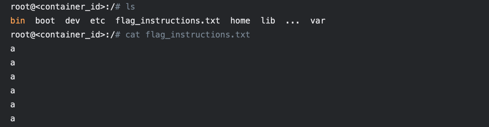

Questo contenuto era chiaramente un depistaggio, dato l'indizio della sfida che la flag era nei layer dell'immagine. Il resto dell'analisi si concentra sull'esame dell'immagine Docker stessa dalla macchina host.

Questo contenuto era chiaramente un depistaggio, dato l'indizio della sfida che la flag era nei layer dell'immagine.

Fase 2: Preparazione all'Analisi dei Layer (sulla macchina locale)
Abbiamo quindi spostato la nostra attenzione dall'interno del container alla nostra macchina locale per analizzare l'immagine Docker stessa.

1. Uscita dal Container:
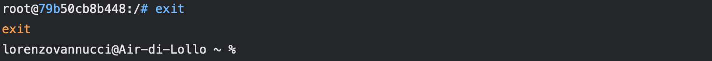

2. Identificazione dell'Immagine Docker Locale:
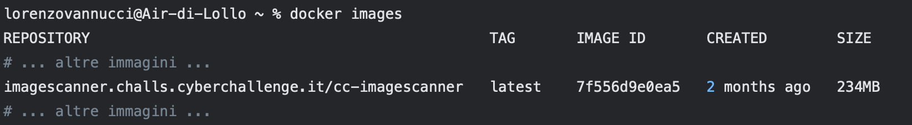
lorenzovannucci@Air-di-Lollo ~ % docker images

L'immagine target è imagescanner.challs.cyberchallenge.it/cc-imagescanner:latest.

3. Analisi della Cronologia dell'Immagine (docker history):
Questo passaggio è importante per capire come è stata costruita l'immagine e identificare i layer sospetti.

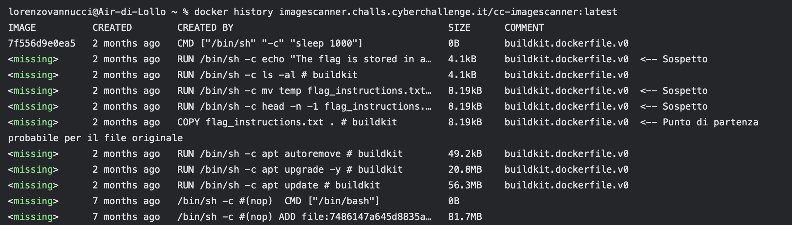

La storia mostra diverse manipolazioni di flag_instructions.txt.

4. Salvataggio dell'Immagine in un Archivio Tar:

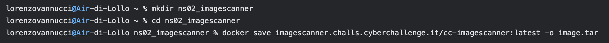

5. Estrazione dell'Archivio dell'Immagine:

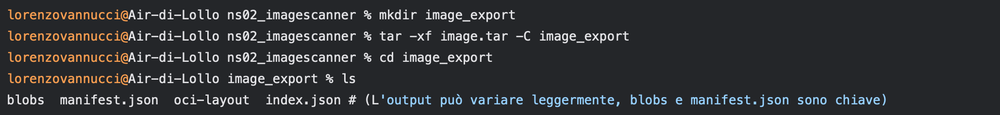

6. Ispezione del manifest.json:
Questo file collega i comandi della history agli hash dei layer effettivi.
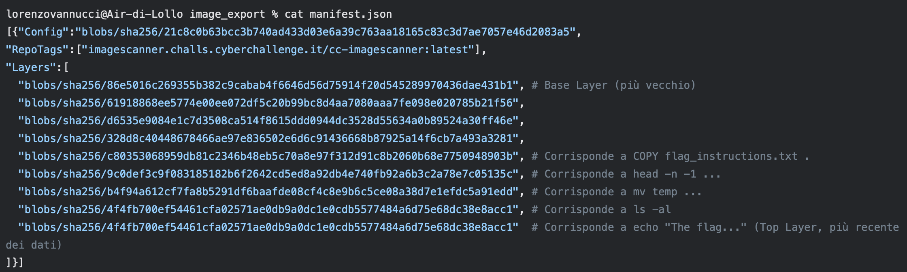

L'ordine nel manifest.json è dal più vecchio (base) al più nuovo. Dobbiamo correlare questo con l'output di docker history (dal più nuovo al più vecchio).

Fase 3: Ispezione Iterativa dei Layer
Abbiamo estratto e ispezionato diversi layer, partendo da quelli che sembravano più promettenti o più recenti, fino a trovare quello corretto.
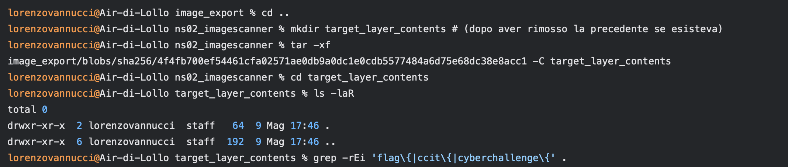

Tentativo 2: Layer mv temp flag_instructions.txt (hash b4f94a61...)

# (Tornati a ns02_imagescanner, ricreato target_layer_contents)
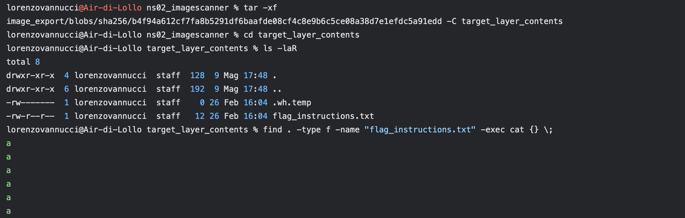

Risultato: Trovato flag_instructions.txt con le "a" e un file whiteout .wh.temp. Ancora nessuna flag.

Tentativo 3 (Corretto!): Layer COPY flag_instructions.txt . (hash c8035306...)
Questo layer è quello in cui il file flag_instructions.txt è stato introdotto per la prima volta.

# (Tornati a ns02_imagescanner, ricreato target_layer_contents)
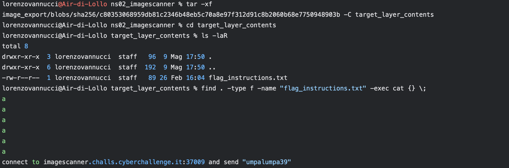

1. Connessione al Servizio:

lorenzovannucci@Air-di-Lollo ~ % nc imagescanner.challs.cyberchallenge.it 37009
# (Il terminale attende input)

2. Invio della Stringa Richiesta:

# (Dopo la connessione, digitare e inviare)
umpalumpa39

3. Ricezione della Flag:
